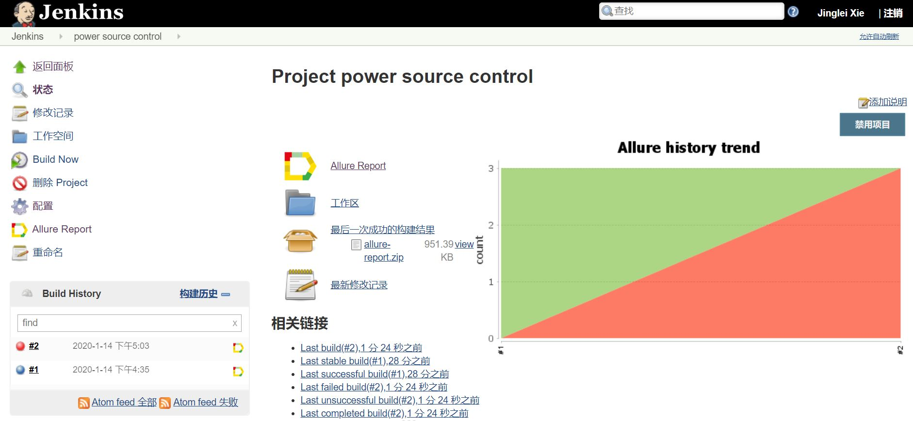

# Jenkins Project Set Up

## Dependency

1. JDK
   
   Download from Oracle and modify environment variables.

## Project url

http://localhost:8080

## Project settings

1. Commands for building
   
   Build -> execute windows batch command
   
   ```
   python -m pytest --alluredir=report
   ```

2. Directory for storing test results (allure directory)
   
   Post build actions -> allure report
   
   Path: `report`

## Project hierarchy
The source code hierachy includes a library of `power source interfaces` and `test case scripts`:
``` 
root
  |- powerLib
      |- DPIB_66319d.py
      |- modbus_DPM9600.py
      |- __init__.py
  |- 66319d_test.py
  |- DPM8600_test.py
```

## Results



## Appendix

### 1. DPIB_66319d.py
```py
import visa


class DPIB_66319d:

    def __init__(self, addr='GPIB0::5::INSTR'):
        rm = visa.ResourceManager()
        self.inst = rm.open_resource(addr)
        print('The following instrument has been connected:')
        print(self.inst.query('*IDN?'))
        self.inst.write('*RST')

    def output_on(self):
        self.inst.write('OUTPut1:STATe 1')

    def output_off(self):
        self.inst.write('OUTPut1:STATe 0')

    def set_voltage(self, voltage):
        vstr = str(voltage)
        cmd = 'VOLT ' + vstr
        self.inst.write(cmd)

    def check_error(self):
        print(self.inst.query("SYSTem:ERRor?"))

```

### 2. modbus_DPM9600.py
```py
import serial
import logging

import modbus_tk
import modbus_tk.defines as cst
from modbus_tk import modbus_rtu


class modbus_DPM8600:

    def __init__(self, com, slave, baud=9600):
        self.slave = int(slave)
        ser = serial.Serial(str(com), baud, bytesize=8, parity='N', stopbits=1)
        self.master = modbus_rtu.RtuMaster(ser)
        self.master.set_timeout(5.0)
        self.master.set_verbose(True)

    def output_on(self):
        self.master.execute(self.slave, cst.WRITE_SINGLE_REGISTER, 0x0002, 2, output_value=1)

    def output_off(self):
        self.master.execute(self.slave, cst.WRITE_SINGLE_REGISTER, 0x0002, 2, output_value=0)

    def set_voltage(self, volatge):
        v = int(100*float(volatge))
        self.master.execute(self.slave, cst.WRITE_SINGLE_REGISTER, 0x0000, 2, output_value=v)

    def __del__(self):
        self.master.close()

```

### 3. 66319d_test.py
``` py
from powerLib.DPIB_66319d import DPIB_66319d
import time


def test0():
    my66319d = DPIB_66319d()
    my66319d.set_voltage(10)
    my66319d.output_on()
    time.sleep(1)
    my66319d.output_off()
```

### 4. DPM8600_test.py
``` py
from powerLib.DPIB_66319d import DPIB_66319d
from powerLib.modbus_DPM8600 import modbus_DPM8600
import time


def setup_module(module):
    # Turn on DPM8600
    my66319d = DPIB_66319d()
    my66319d.set_voltage(10)
    my66319d.output_on()
    time.sleep(0.5)


def test_ouput():
    inst = modbus_DPM8600('COM3', 2)
    inst.output_on()
    time.sleep(1)
    inst.output_off()


def test_change_voltage():
    inst = modbus_DPM8600('COM3', 2)
    inst.set_voltage(3.5)


```